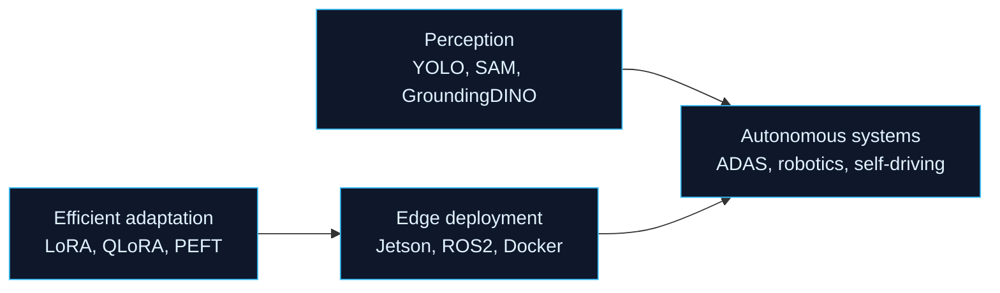

  

  

  
  
  
  
  

  
  
  

## Research profile

I am an Artificial Intelligence undergraduate at **FPT University Can Tho** with a research and engineering focus on **computer vision**, **efficient model adaptation**, and **autonomous systems**. My work aims to move AI from papers and prototypes into real robotics, ADAS, and edge-device workflows.

I am currently open to **AI Research**, **Computer Vision**, and **AI R&D Engineer** opportunities, especially in autonomous driving, robotics, VLM adaptation, and edge AI.

<table>
  <tr>
    <td><strong>Education</strong></td>
    <td>Bachelor of Artificial Intelligence, FPT University Can Tho</td>
  </tr>
  <tr>
    <td><strong>GPA</strong></td>
    <td>8.77 / 10</td>
  </tr>
  <tr>
    <td><strong>Core domains</strong></td>
    <td>Computer Vision, Autonomous Systems, Edge AI, Vision-Language Models</td>
  </tr>
  <tr>
    <td><strong>Current target</strong></td>
    <td>Internship / Fresher AI R&amp;D Engineer roles</td>
  </tr>
</table>

## What I build

## Selected work

| Project | Role | Signal |
| --- | --- | --- |
| [Video Retrieval System - Top 1 AI Challenge PTIT](https://github.com/MonsieurNam/object_video_retrieval) | First Prize Winner | YOLO + SAM + CLIP pipeline for object-aware video search, temporal reasoning, and visual report generation. |
| [SingLoRA-CLIP](https://github.com/MonsieurNam/singlora_clip) | Primary Researcher & Developer | PEFT method for CLIP using a single symmetric update matrix, reducing trainable parameters by **50%**. |
| [QLoRA-CLIP IxT](https://github.com/MonsieurNam/QLORA_CLIP_IxT.git) | First Author & Primary Researcher | VLM memory analysis with gradient checkpointing, reducing peak training VRAM to **0.17 GB**. |
| [Traffic Sign Detection for Autonomous Vehicles](https://www.sciencedirect.com/science/article/pii/S2215098625000837) | Core Developer | Lightweight traffic sign detection with self-distillation on ResNet34 and Grounding DINO for open-set detection. |
| [PIXEL PLANE](https://github.com/MonsieurNam/PIXEL_PLANE) | Core Developer | Generative AI data engine for autonomous-vehicle datasets using Streamlit, GroundingDINO, SAM, PowerPaint, and Stable Video Diffusion. |

## Publications

<!-- SCHOLAR-LIST:START -->
<table>
  <tr>
    <th>Title</th>
    <th>Venue</th>
    <th>Year</th>
  </tr>
  <tr>
    <td><a href="https://link.springer.com/article/10.1007/s11760-024-03779-w">Enhancing Semantic Scene Segmentation for Indoor Autonomous Systems Using Advanced Attention-Supported Improved UNet</a></td>
    <td>Springer: Signal, Image and Video Processing</td>
    <td>2025</td>
  </tr>
  <tr>
    <td><a href="https://link.springer.com/article/10.1007/s11042-024-19302-9">Semantic Scene Segmentation for Indoor Autonomous Vision Systems: Leveraging an Enhanced and Efficient U-Net Architecture</a></td>
    <td>Springer: Multimedia Tools and Applications</td>
    <td>2025</td>
  </tr>
  <tr>
    <td><a href="https://www.sciencedirect.com/science/article/pii/S2215098625000837">Grounding DINO and Distillation-Enhanced Model for Traffic Sign Detection</a></td>
    <td>ScienceDirect / Elsevier</td>
    <td>2025</td>
  </tr>
</table>

More publication and citation details are available on <a href="https://scholar.google.com/citations?user=OtccK6UAAAAJ">Google Scholar</a>.

<!-- SCHOLAR-LIST:END -->

## Leadership

| Experience | Role | Contribution |
| --- | --- | --- |
| Vietnam Robotic Challenge (VORC) | Technical Mentor | Mentored teams in robot design, AI implementation, and competition preparation. |
| Autonomous Race Competition 2024 | Technical Mentor & Organizing Committee | Coordinated the competition and supported students on self-driving car technologies. |

## Technical stack

  

<table>
  <tr>
    <td><strong>AI / ML</strong></td>
    <td>PyTorch, TensorFlow, Hugging Face Transformers, PEFT, LangChain</td>
  </tr>
  <tr>
    <td><strong>Computer vision</strong></td>
    <td>Object detection, tracking, semantic segmentation, visual retrieval, synthetic data generation</td>
  </tr>
  <tr>
    <td><strong>Autonomous systems</strong></td>
    <td>ROS2, Jetson Nano, Docker, Ubuntu, ADAS perception workflows</td>
  </tr>
  <tr>
    <td><strong>Research interests</strong></td>
    <td>Efficient VLM adaptation, edge AI, robotics, autonomous driving</td>
  </tr>
</table>

## GitHub metrics

  

  
  
  

  
  

## Connect

I am open to research collaborations, robotics projects, and AI engineering opportunities.

- Email: [namnguyenfnw@gmail.com](mailto:namnguyenfnw@gmail.com)
- Portfolio: [nguyennhatnam.id.vn](https://nguyennhatnam.id.vn/)
- LinkedIn: [Nguyen Nam](https://www.linkedin.com/in/nguyen-nam-893b52280/)
- GitHub: [MonsieurNam](https://github.com/MonsieurNam)
- Google Scholar: [Nguyen Ngo Nhat Nam](https://scholar.google.com/citations?user=OtccK6UAAAAJ)

<!---
MonsieurNam/MonsieurNam is a special repository because its README.md appears on the GitHub profile.
--->
